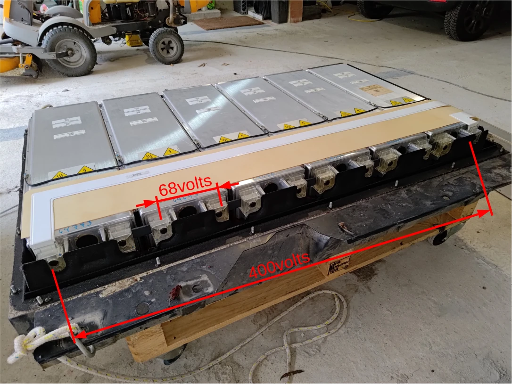
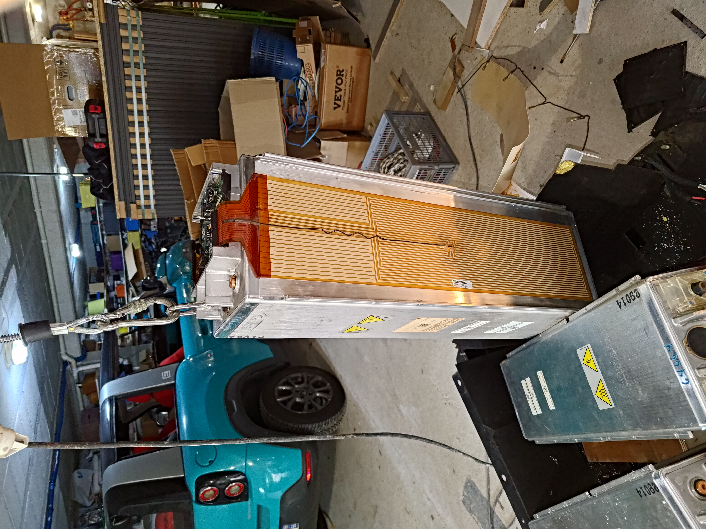

# e-mehari bluecar LMP reverse engineering

This repository track my own work on understanding how the e-mehari electrical traction is implemented. Technically the e-mehari uses the same LPM electrical traction as Bollore Bluecar. LMP technology imposes to keep the battery at 80°C. As a result this car is probably the only one the consume more energy on parking than on road.

## Dismounting the battery

Expect for the 350kg, dismounting the battery is relatively simple.

* start removing the screw around rear wheels that otherwise prevent from extracting the battery. This should be done 1st, as when removing next screws, the battery will lower down making hard to impossible the access those rear wheel attaches.
* place a support to keep control of the 350kg and move smoothy the battery down
* remove the 10 big screws that fix the battery cabinet to car's body
* when the battery is down on the ground, lift the car up over the battery. Without battery two persons can easily lift rear car and roll it over the battery
* **Warning**: to move the battery on a trailer/support you need a winch capable of pulling/lifting 350kg

**Note**: even is the battery is loaded you cannot touch 400v when extracting it. The main output is protected with a relay and no power is visible on the plug.

## Openning the battery and access LPM cells

To open the box remove screw nuts and open the cabinet. The top is soft sealed to make it waterproof, but a gentle screw driver should do the job. When open you should see the 6 LPM cells, each of them is 68 volts. They are connected in series to provide main traction at 408v.

**WARNING**: even when classify as "dead" you should still have 68v on individual cells. Use adequate equipment to open the circuit and remove serial shunts. Start removing a shunt from a middle cell to break serial 408v circuit.

## Disassembling cells pack

The 6 cells are not designed to be removed individually from the enclosure cabinet. Nevertheless as handling 300kg is not simple, you may want to extract cell on per one. I used a small electrical winch to lift up the cells.

**Note**: not only cells are screwed to cabinet bottom the are all attach together with rivets that you should drill to free them.

**Warning** at this point you should already have remove serial shunts to address the 408volts issue.

Slightly lift cells and access top covers to remove all connections (BMS & heating).

You are now ready lift each cell individually. Drill a hole in BMS radiator and insert a shackle to attach a winch cable starting from right most cell. Note that when lifting a cell, the full pack comes. This operation may require some gentle "brute force". To force cells separation:

* lift top/connection side of the full cell pack at 20-30cm with your winch
* use a piece a wood to prevent the cell left to the one you target to get down.
* lift down your cable winch. The piece of wood prevent the left cell to move down when your right cell should move lower and detach.

## Opening one cell to core elements

LPM cells boxes are build as "vault". Accessing core elements is not easy. The box is 4mm aluminum; I use 4 grinder disks and a lot of energy before successfully open the box. At the back of box top you find the slave BMS board and the individual connection for load balancing to core 3.7v battery elements.

**Warning**: doing this will definitively destroy your cell.

If you go further and continue opening individual cell cabinet you will find that each LPM cell is composed on two set of 9 core elements. Each core element has it own set of dilatation springs. **Note** compression is impressive that outside of fully open the cabinet with a grinder they is no way to extract battery core elements.

